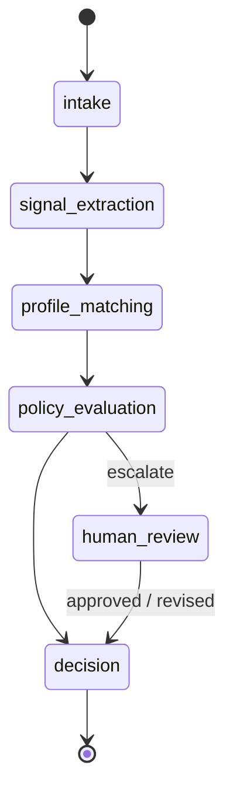
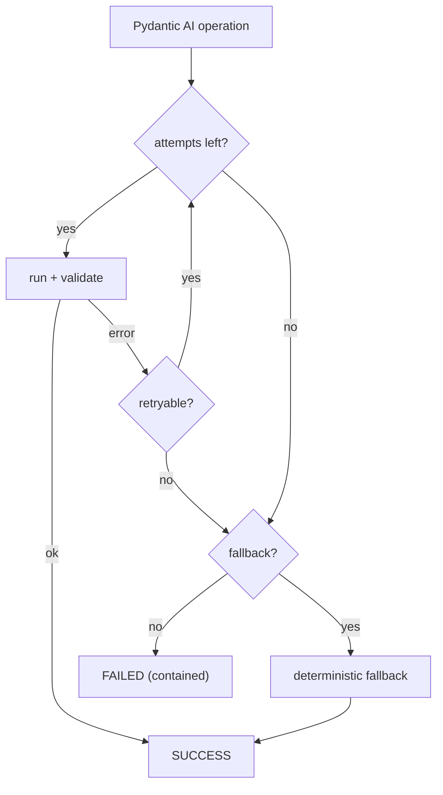

# Architecture — Bounded Application Workflow

Bounded agents behind typed contracts. Priorities: bounded execution · explicit state transitions · observable decisions · human oversight.

Stack: **LangGraph** (orchestration) · **Pydantic AI** (agents) · **Logfire** (observability) · **Pydantic Evals** (evaluation). 

## Orchestration

LangGraph `StateGraph` nodes: `signal_extraction` → `JobSignals` → `profile_matching` → `ProfileMatchResult` → `policy_evaluation` → `WorkflowDecision`. Escalation via `interrupt`; approve/revise via `Command`. Checkpointed `WorkflowGraphState` holds data plus thin audit (`events`, `human_review`); plan vs execution via `WorkflowPlan` / `PlanExecutionReport`.

## Agents

Each stage is a typed `Protocol`. LLM agents (e.g. `LLMSignalExtractor`) use Pydantic AI for structured outputs; `BoundedAgentRuntime` bounds attempts, deterministic fallback, and `AgentExecutionResult` provenance. Prompts and runtime settings are versioned (`RUNTIME_CONFIG_VERSION`).

## Observability & evaluation

- **Logfire** — OTel spans across FastAPI, LangGraph, and Pydantic AI (`app/observability.py`). Optional `LOGFIRE_TOKEN`.
- **Evals** — golden dataset via Pydantic Evals (precision / recall / F1); `pytest -m llm`.

Details: [module README](../modules/bounded-application-workflow/README.md) · [runtime](../modules/bounded-application-workflow/app/runtime/README.md) · [agents](../modules/bounded-application-workflow/app/agents/README.md) · [eval](../modules/bounded-application-workflow/eval/README.md).

## Influences

- [OpenClaw](https://github.com/openclaw/openclaw)
- [LangGraph](https://github.com/langchain-ai/langgraph)
- [Pydantic AI](https://ai.pydantic.dev/)
